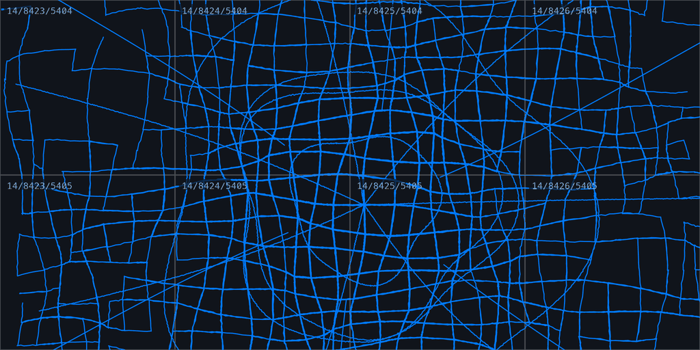

# gpx_tile_generator

[](LICENSE)

Render GPS tracks into Web Mercator raster map tiles — on the GPU where one is
available, on the CPU where it isn't.

Give it `(lat, lon)` points; get back `{z}/{x}/{y}.png` tiles you can drop
behind Leaflet, MapLibre or any XYZ layer. Built for drawing years of recorded
tracks as a single trace layer, where re-rendering the whole pyramid needs to
take seconds rather than hours.



## What it does

```text
(lat, lon)  --project-->  [0,1]  --bucketize_track-->  per-tile polylines
                                                              |
                           encode_bin  <--- store ---         |
                                                              v
                                           TileRasterizer::render_batch
                                                              |
                                                              v
                                           encode_indexed_coverage -> PNG
```

## Install

Not on crates.io — depend on it straight from git:

```toml
[dependencies]
gpx_tile_generator = { git = "https://github.com/mjarkk/gpx_tile_generator" }
```

Pin a tag so a push to `main` can't move under you:

```toml
gpx_tile_generator = { git = "https://github.com/mjarkk/gpx_tile_generator", tag = "v0.1.0" }
```

CPU only, for a much smaller dependency tree:

```toml
gpx_tile_generator = { git = "https://github.com/mjarkk/gpx_tile_generator", default-features = false }
```

API docs aren't on docs.rs either — build them locally with `cargo doc --open`.

## Usage

```rust
use gpx_tile_generator::{
    bucketize_track, encode_indexed_coverage_rgb, project, TileBuckets, TileJob, TileRasterizer,
};

let track: Vec<(f64, f64)> = my_points   // your .gpx, .fit, database, whatever
    .iter()
    .map(|&(lat, lon)| project(lat, lon))
    .collect();

let zoom = 14u32;
let mut buckets = TileBuckets::default();
bucketize_track(&track, (1u32 << zoom) as f64, 0.25, &mut buckets);

let jobs: Vec<TileJob> = buckets
    .iter()
    .map(|(&(x, y), polylines)| TileJob { x, y, polylines })
    .collect();

let rasterizer = TileRasterizer::new();
for tile in rasterizer.render_batch(&jobs, 3.0, true, 255) {
    let png = encode_indexed_coverage_rgb(&tile.coverage, (0x00, 0x7A, 0xFF));
    // write to tiles/{zoom}/{tile.x}/{tile.y}.png
}
```

`bucketize_track` appends, so call it once per track to accumulate every ride
into one set of tiles before rendering.

A complete runnable version, writing a real pyramid to disk:

```sh
cargo run --release --example render_track -- ./tiles
```

Then point a map at it:

```js
L.tileLayer("/tiles/{z}/{x}/{y}.png", { tileSize: 512, maxZoom: 14 }).addTo(
  map,
);
```

## Notes and limits

- **Tiles are 512×512**, fixed at compile time. Serve them to a 256 dp map by
  setting the client's `tileSize` to 512; they're oversampled so retina screens
  stay crisp.
- **No GPX parser.** The crate takes `(lat, lon)` and nothing else — pair it
  with [`gpx`](https://crates.io/crates/gpx) or any other reader.
- **Points past the Mercator limit** (|lat| > 85.051129°) project outside
  `[0, 1]` and are dropped rather than clamped.
- **`wasm32`** compiles the GPU path out entirely and always rasterizes on the
  CPU.
- **The crate never writes to stderr.** If the GPU is unavailable,
  `TileRasterizer::new()` falls back silently; `is_gpu()`, `gpu_info()` and
  `gpu_error()` tell you what happened.

## MSRV

Rust 1.94. The aarch64 NEON f16 intrinsics used by the `.bin` codec stabilized
there.

## License

[WTFPL](LICENSE) — Do What The Fuck You Want To Public License, Version 2.

Note that the WTFPL carries no warranty disclaimer. If you'd rather have one
while keeping the same "do anything" spirit, the
[Unlicense](https://unlicense.org) is the usual swap.
